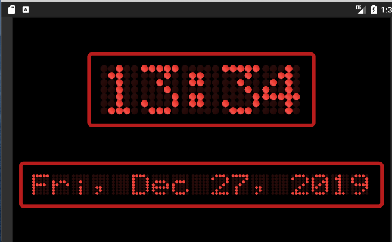
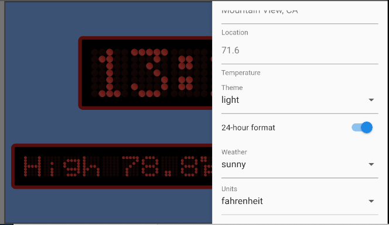

`# Dot Matrix Clock

Flutter Clock Challenge Submission

## How to Start the Dot Matrix Clock

From the `dot_matrix_clock` directory, run the command

```
flutter run
```




The Dot Matrix Clock supports landscape only.

## How to Configure the Dot Matrix Clock

To configure the Dot Matrix Clock:

1.  Tap on the clock
2.  Tap on the gear appearing in the extreme upper right.
3.  From the menu, change the settings.



The Dot Matrix Clock utilizes the `Clock Model` as recommended by the contest rules.

The Dot Matrix Clock uses all properties of the `Clock Model`:

* Weather condition
* Current temperature
* Low temperature
* High temperature
* Celsius and Fahrenheit display
* Location
* Light theme and dark theme
* 12-hour and 24-hour clock display


